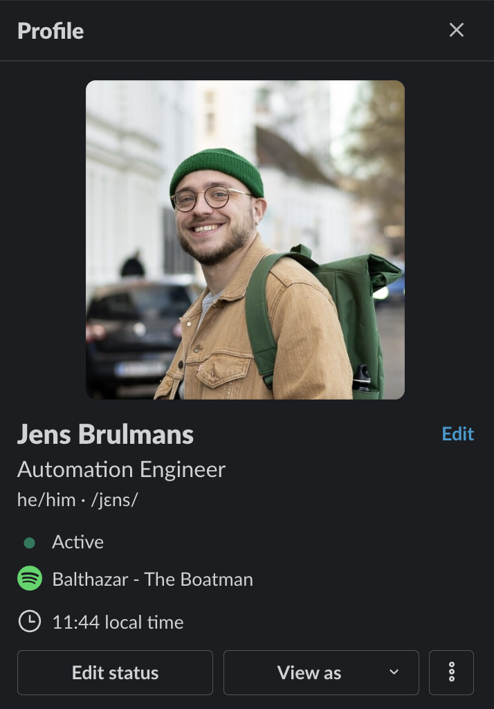

#  spotify-to-slack 

A script that shows your spotify song playing to your slack status via a MacOS Launch Agent based on [jgamblin](https://gist.github.com/jgamblin)'s code snippet.

## Usage

The script is meant to be run as a daemon with the MacOS Launch Agent so it can be run with an interval. The script will periodically check if Spotify is playing a song or not and if it is, report it to the Slack API as a Slack status. If it's not playing anything anymore, it will automatically report an empty status again to Slack.

<p align="center">
    
    &nbsp;&nbsp;&nbsp;&nbsp;
    
</p>

## Installation

### 1. Prerequisites

Install `jq` from `brew`

```bash
brew install jq
```

### 2. Permissions

Make sure the script and the directory have the necessary permissions to run.

```bash
chmod -R 755 spotify-to-slack/
```

### 3. Setting the necessary variables

Set the `APIKEY` and `EMOJI` variables in the `spotify-to-slack.sh` script.

For `APIKEY`, you will need to generate a new Slack API token via a new Slack app [here](https://api.slack.com/apps):

- Create a new Slack app
- Select Permissions > Scopes > User Token Scopes and add `users.profile:write`
- Scroll up and select Install to Workspace under OAuth Tokens for Your Workspace
- Copy User OAuth Token under OAuth Tokens for Your Workspace

For `EMOJI`, you can use whatever emoji is available on slack **or** on your custom slack environment. Just simply enter the slack emoji name with the leading and trailing `:`. E.g. the default emoji is `":headphones:"` (🎧).

Now if you run the script with

```bash
sh spotify-to-slack.sh
```

it should set your current song playing as your slack status (only once for now though)

### 4. Set up launch agent

You can have this run automatically on your mac using the native launchd system:

Drop the following `plist` into `~/Library/LaunchAgents/com.user.spotify-to-slack.plist`. The filename must match the string under Label, replace `/PATH/TO/SCRIPT.sh` with an actual path to the .sh script above.

> :warning: **Make sure to set the relevant `PATH` locations in `EnvironmentVariables`**! E.g. `/opt/homebrew/bin:/opt/homebrew/sbin:/usr/local/bin:/usr/bin:/bin:/usr/sbin:/sbin`

```xml
<?xml version="1.0" encoding="UTF-8"?>
<!DOCTYPE plist PUBLIC "-//Apple Computer//DTD PLIST 1.0//EN" "http://www.apple.com/DTDs/PropertyList-1.0.dtd">
<plist version="1.0">
    <dict>
        <key>Label</key>
        <string>com.user.spotify-to-slack</string>
        <key>ProgramArguments</key>
        <array>
            <string>sh</string>
            <string>/Users/jbrulmans/src/spotify-to-slack/spotify-to-slack.sh</string>
        </array>
        <key>EnvironmentVariables</key>
        <dict>
          <key>PATH</key>
          <string>/opt/homebrew/bin:/opt/homebrew/sbin:/usr/local/bin:/usr/bin:/bin:/usr/sbin:/sbin</string>
        </dict>
        <key>RunAtLoad</key>
        <true/>
        <key>StartInterval</key>
        <integer>60</integer>
        <key>StandardErrorPath</key>
        <string>/Users/jbrulmans/src/spotify-to-slack/.logs/error.log</string>
        <key>StandardOutPath</key>
        <string>/Users/jbrulmans/src/spotify-to-slack/.logs/output.log</string>
    </dict>
</plist>
```

Then, register this daemon with launchd by running:

```bash
launchctl load ~/Library/LaunchAgents/com.user.spotify-to-slack.plist
```

Start it by either logging out and back in or running:

```bash
launchctl start com.user.spotify-to-slack
```

Finally, make sure the status of the loaded agent is `0`. If it show any different number, look up the error code and check what might have gone wrong.

```bash
$ launchctl list | grep 'com.user.spotify-to-slack'
- 0 com.user.slack-spotify
```

## Starting and stopping the script

To stop or temporarily pause the script from updating your slack. Please unload the Launch Agent with:

```bash
launchctl unload ~/Library/LaunchAgents/com.user.spotify-to-slack.plist
```

To reload it again, once again run:

```bash
launchctl load ~/Library/LaunchAgents/com.user.spotify-to-slack.plist
```

> ℹ️ **For ease of use you could add aliases to your `.zshrc` for starting and stopping the script:**
```bash
alias start-spotify-to-slack='launchctl load ~/Library/LaunchAgents/com.user.slack-spotify.plist'
alias stop-spotify-to-slack='launchctl unload ~/Library/LaunchAgents/com.user.slack-spotify.plist'
```

## Run the script **without** Launch Control

If you don't want to set up the script running automatically via Launch Control, but you would like to manually start and stop the script when you feel like it. You can make the following changes to the code and **ignore** step 4 in the installation.

Add the following line (`>`) before `state=$(...`:

```bash
> while true; do
    state=$(osascript -e 'tell application "Spotify" to player state')

    date
    echo "Spotify: "$state
```

And add the following lines (`>`) after the `fi` statement:

```bash
        curl -X POST --data "$JSON" -H "Authorization: Bearer $TOKEN" -H "Content-Type: application/json; charset=utf-8" --silent -o /dev/null https://slack.com/api/users.profile.set | jq 'del(.profile)'
    fi

>   sleep 60
> done
```

This basically adds an infite loop that gets re-run every 60 seconds until the script is shutdown manually.
